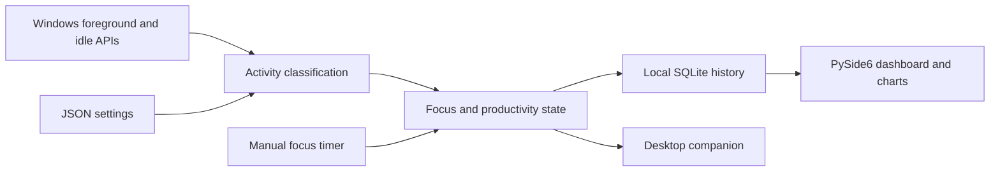

# MoodPet

A native Windows productivity companion with activity tracking, focus timers, persistent history, and an interactive Qt dashboard.

## Why this project exists

Small focus sessions are easier to sustain when progress is visible. MoodPet connects foreground activity and deliberate focus sessions to daily charts, streaks, and a desktop companion that remains available from the system tray.

## Architecture



Activity monitoring, productivity state, persistence, and UI live in separate `app/` packages. Settings and history remain on the local machine.

## Engineering Highlights

- Durable daily activity and session records drive streaks, XP, achievements, and history across restarts.
- Focus timers support pause/resume and partial-session recording; automatic sessions are suppressed during manual focus and breaks to avoid double counting.
- Idle tracking handles Windows tick-counter wraparound, with regression coverage.
- Charts offer 7/30-day activity views, a 12-week calendar, hover details, and CSV export.
- Monitoring reads foreground app names and window titles for classification; stored records contain aggregate durations and sessions, not titles or keystrokes.

## Tech Stack

**Desktop:** Python 3.10+, PySide6. **Persistence:** SQLite and JSON. **Platform:** Windows APIs. **Validation:** Python `unittest`, including storage, timer, tracking, chart, and dashboard tests.

## How It Works

Click the pet or tray icon to open the dashboard. Activity matching your rules is classified as productive or distracted; idle time is tracked separately. A streak day requires **15 productive minutes or one completed focus session**. Manual focus timers measure session time independently of app classifications.

Settings are stored at `%USERPROFILE%\.moodpet\config.json`; history is at `%USERPROFILE%\.moodpet\moodpet.db`. Timers are saved as partial on a normal exit and are not resumed after restarting. A forced termination may lose the active unfinished session.

## Setup

Requires Windows 10/11 and Python 3.10 or newer.

```powershell
git clone https://github.com/yashwant938/MoodPet.git
cd MoodPet
python -m venv .venv
.\.venv\Scripts\python.exe -m pip install -r requirements.txt
.\.venv\Scripts\python.exe main.py
```

Drag the pet to reposition it. Right-click for preferences or **Exit MoodPet**. Closing the dashboard leaves the companion running.

## Example

Open the dashboard, start a 25-minute focus session, pause and resume as needed, and complete it. The session appears in history and contributes to the day's streak. Reopen MoodPet to inspect the saved record. The session timer does not reclassify unrelated foreground activity as productive.

## Engineering Challenges

Time-based state must remain consistent through pauses, sleep gaps, midnight boundaries, and restarts. Tests exercise these transitions and persistence rules. Activity classification depends on editable app/title rules, so it is a useful personal signal rather than a measure of work quality.

Run the regression suite and an optional dashboard preview with disposable fixture data:

```powershell
.\.venv\Scripts\python.exe -m unittest discover -s tests -v
.\.venv\Scripts\python.exe scratch/render_dashboard.py
```

## Future Improvements

- Add packaged Windows releases and automated Windows CI.
- Improve recovery of unfinished sessions after unexpected termination.
- Add configurable retention and richer import/export options.

See the [usage and data guide](docs/USAGE.md) for exact scoring, history, automatic-session, and reset behavior.
